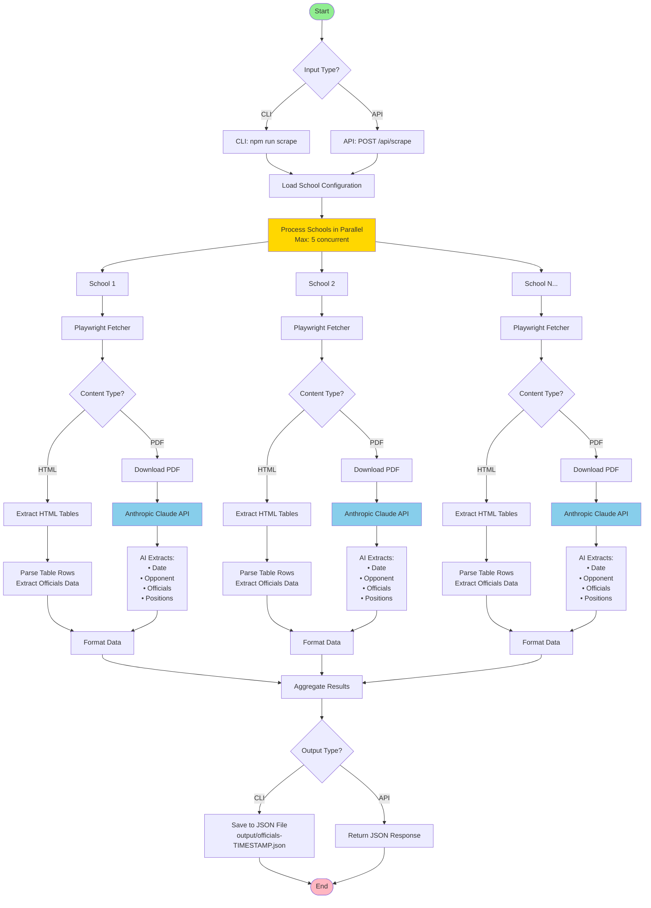
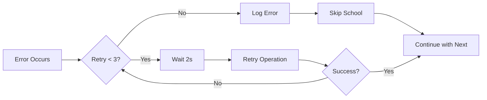

# Officials Scraper - System Flow Diagram



## Flow Description

### 1. **Input Layer**
- **CLI Mode**: Direct execution via `npm run scrape`
- **API Mode**: REST API endpoint `/api/scrape`

### 2. **School Configuration**
- Loads school-specific configurations from `src/config/school-config.ts`
- Each school has a unique URL and scraping strategy

### 3. **Parallel Processing**
- Processes up to 5 schools concurrently (configurable)
- Each school runs independently to maximize throughput

### 4. **Content Fetching** (Playwright)
- Launches headless Chromium browser
- Navigates to school's officials page
- Handles JavaScript-rendered content
- Detects content type (HTML tables or PDF links)

### 5. **Content Type Detection**
```
IF content is HTML table:
  → Parse HTML directly
ELSE IF content is PDF:
  → Download PDF → Send to AI
```

### 6. **Data Extraction**

#### HTML Path:
- Parse table structure
- Extract rows with game data
- Map columns to fields (date, opponent, officials)

#### PDF Path:
- Download PDF file
- Send to Anthropic Claude API
- AI analyzes document structure
- AI extracts structured data
- Tracks token usage for cost monitoring

### 7. **Data Formatting**
Standardizes output format:
```json
{
  "school": "georgia",
  "games": [
    {
      "date": "2025-09-06",
      "opponent": "Clemson",
      "officials": [
        {"name": "John Smith", "position": "Referee"}
      ]
    }
  ]
}
```

### 8. **Output**
- **CLI**: Saves to `output/officials-[timestamp].json`
- **API**: Returns JSON response with results and metadata

---

## Key Technologies

| Component | Technology |
|-----------|-----------|
| Web Scraping | Playwright (Chromium) |
| AI Processing | Anthropic Claude API |
| Runtime | Node.js + TypeScript |
| API Server | Express.js |
| Concurrency | Promise.all with semaphore |

---

## Error Handling Flow



---

## Performance Metrics

- **Average School Processing**: 5-15 seconds
- **HTML Parsing**: ~1-2 seconds
- **PDF AI Extraction**: ~3-10 seconds
- **Concurrent Limit**: 5 schools
- **Total Time (All Schools)**: ~2-5 minutes
